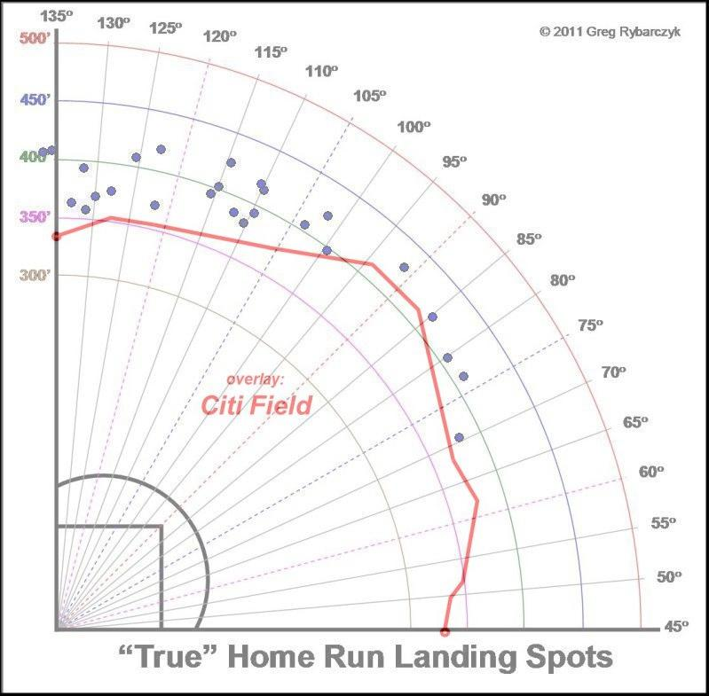
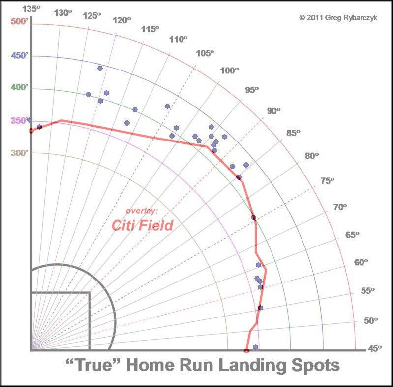
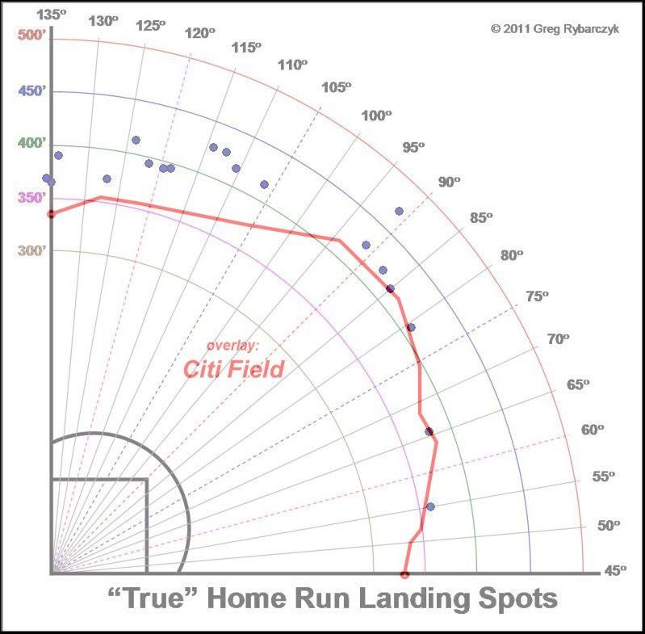
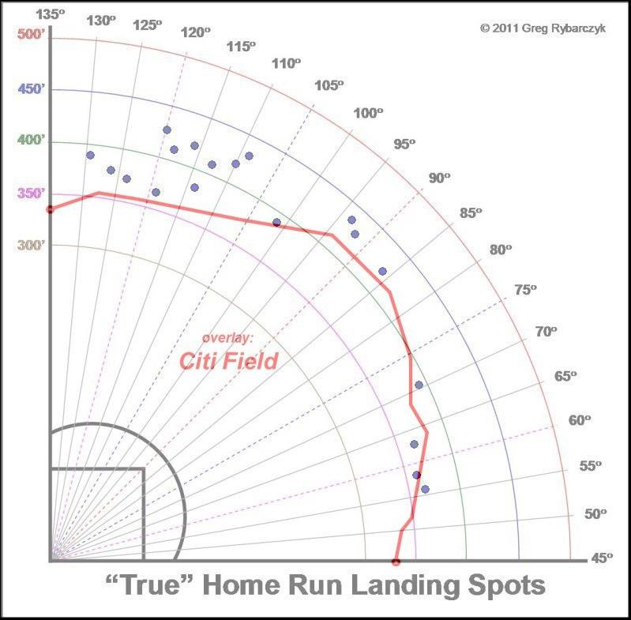

Todd Frazier is the recent winner of the 2015 Home Run Derby.  A native of Toms River, New Jersey, Frazier also went on to win the Little League World Series in 1998, hit a home run with no hands in the majors, and saved someone's life using the heimlich maneuver in a Cincinnatti restaurant.  To sum it up Frazier, has become quite the folk hero and has been rumored to be on the trading block.  Is he a fit with the Mets? 


###Patience
With David Wright suffering from spinal stenosis, a chronic injury that will eventually cut his career short, and Daniel Murphy not signed on past this year, a third baseman could be a teriffic idea for the Mets to target at the deadline.  Troy Tulowitzki, the so-called "White Whale" for Sandy Alderson is supposedly a target of the Mets, but will cost much more in terms of prospects.  Would he eventually move to third base, al-la Alex Rodriguez?  Is he worth the added cost of prospects vs Frazier?

Over the past few years, Frazier has really become a more patient hitter than Tulo, Wright, and Murphy, and as he is taking more and more pitches in a game as he gets older.  

```{r ONE, echo = FALSE}
suppressPackageStartupMessages(require(ggplot2))
suppressPackageStartupMessages(require(lubridate))
all <- read.csv("all.csv")
all[,2] <- ymd(all[,2])
g <- qplot(Date, Pitches, data = all, colour = Player)+geom_smooth(method=loess, size = 1, alpha = .2)
g <- g+scale_colour_brewer(palette="Set1")+ylim(0,30)+ggtitle("Pitches in a game")
suppressWarnings(print(g))
```


### Clutch
Working counts is something, the Mets organization preaches, as it leads to walks, runners, and putting yourself in a leveraged position to succeed, ideally against relievers.  All of these hitters get themselves in reasonably good counts to succeed but who does it the best in those crucial situations? pLI is a stat that judges the batters Leveraged Index.  It is a stat that puts tie games in the late innings ahead of those in the 3rd.  0.85 is about average. Frazier has a weighted average around 1 over his career where as the rest are around 0.5.

```{r TWO, echo=FALSE}
g <- qplot(Date, pLI, data = all, colour = Player)+ylim(0.5,1.5)+geom_smooth(method = loess, size = 1, alpha = .2)
g <- g+ggtitle("pLI")+scale_colour_brewer(palette="Set1")
suppressWarnings(print(g))
```

Frazier is a better clutch performer, in high pressure situations throughout the games and given his growing urban legend, and most importantly trend line throughout his career, there's no reason for him to slow down.  He's also a little younger than Murphy, Tulo, and Wright.  Moreover, he's without an injury history!


### Trip to the big Citi
Frazier's translation from the band box of Great American Ballpark to Citi Field is defintiely a question that needs to be answered.  Below is Frazier's spray chart over the past 4 years with Citi Field Overlayed.  There are not many homers that would not be out in Citi.  Especially ones he pulls. Kevin Long, no doubt, will preach to pull more.

2015



2014


2013


2012



Here is a look at Frazier's weighted Runs Created plus(wRC+), which negates the effect of the ballpark in how many runs they can create.  In comparison to Wright, Tulo, and Murph, Frazier again beats them and is trending up.

```{r four, echo =FALSE}
g <- qplot(Date, wRC., data = all, colour = Player)+geom_smooth(method = loess, size = 1, alpha = .2)
h <- g+scale_colour_brewer(palette="Set1")+ylim(0, 500)+ggtitle("wRC+")
suppressWarnings(print(h))
```


###Remaining Opponents
For the rest of the 2015 season, how will Frazier contend vs pitchers remaining on the Mets schedule?  I took the averages of the pitchfx (pFX) of the pitching staffs of the remaining teams and filtered the stats for those above those averages. I took into account velocity, lateral movement (X), and vertical movement (Z) and compared the same players wRC+ and pLI.

```{r five, echo = FALSE}
require(lubridate)
opp <- read.csv("opposition.csv")
opp[,2]<- ymd(opp[,2])

g <- qplot(Date, wRC., data = opp, colour = Player)+geom_smooth(method = loess, size = 1, alpha = .2)+ylab("wRC+")
h <- g+scale_colour_brewer(palette="Set1")+ylim(0,500)+ggtitle("wRC+ vs Remaining Opponents")
suppressWarnings(print(h))
g <- qplot(Date, pLI, data = opp, colour = Player)+geom_smooth(method = loess, size = 1, alpha = .2)
h <- g+scale_colour_brewer(palette="Set1")+ylim(0,1.5)+ggtitle("pLI vs Remaining Opponents")
suppressWarnings(print(h))
```


###Conclusion
Is he worth the prospects?  I would trade Wheeler and Montero for a player of his caliber this year.  Todd Frazier is 29 years old with a great approach at the plate who can drive in runs in clutch situations.  Furthermore, the Mets would be able to contend this yeark, and Frazier has expressed his interest in playing for New York.  Lastly, he comes up to the plate with Frank Sinatra blasting.  "Come Fly with the ME-T-S", Todd.


